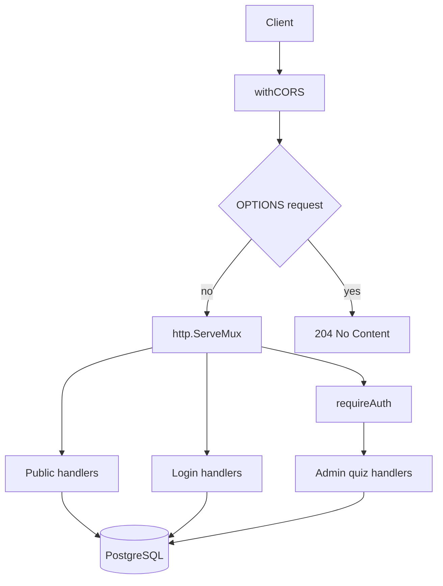
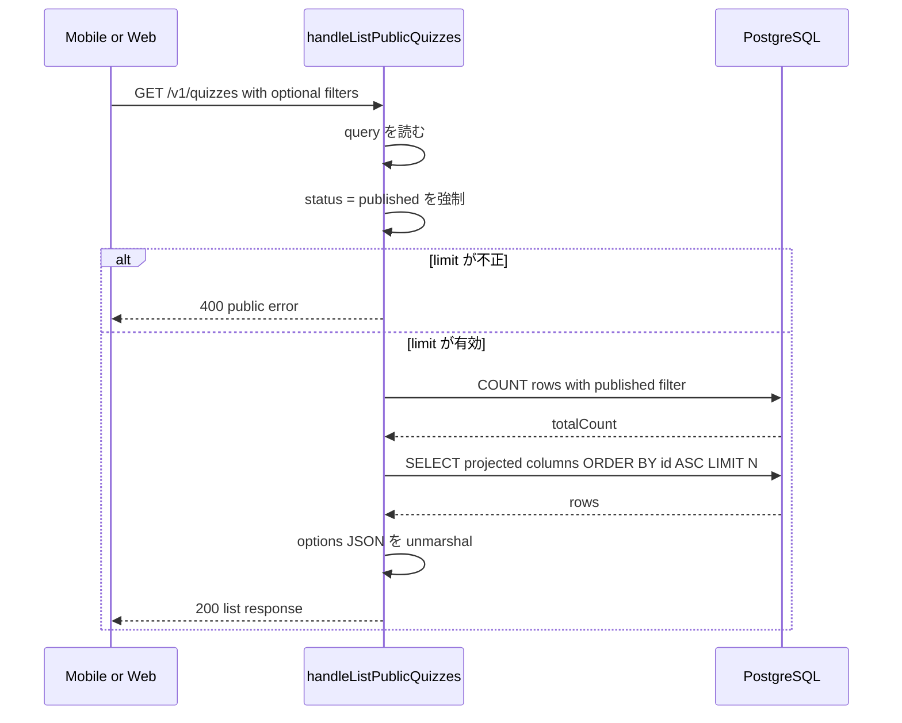
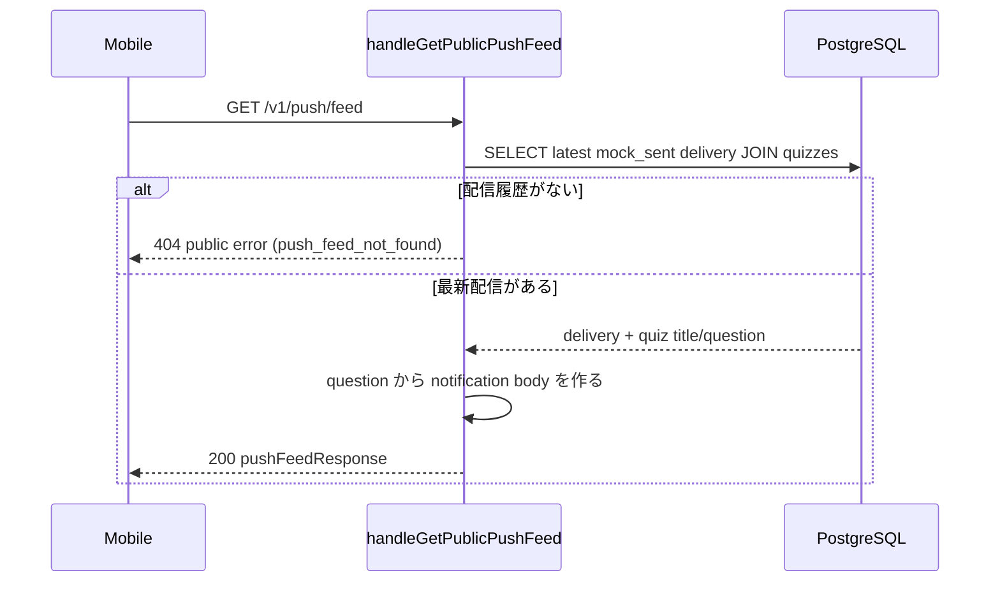
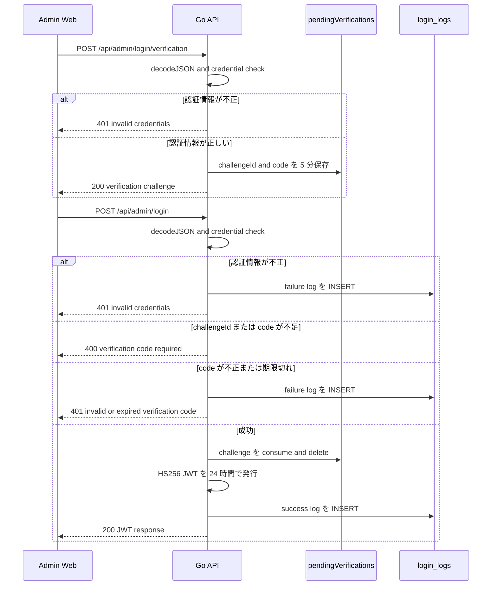
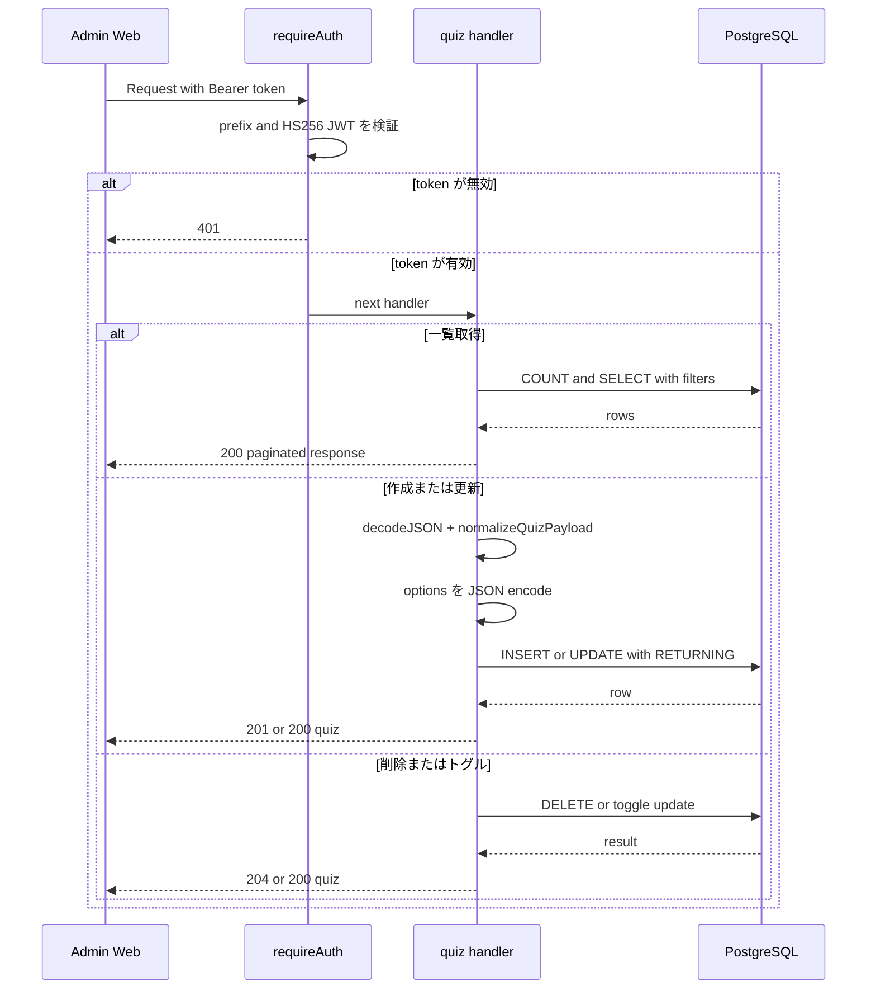

# バックエンドリクエストフロー

`backend/main.go` の HTTP リクエスト処理を、ルーティング・認証・主要ハンドラ単位で整理する。
対象は `net/http` ベースの API 本体で、クライアント実装や DB スキーマの詳細は別ドキュメントに委ねる。

## 入口

### 実装メモ

- `withCORS` は全ルートの最外周にあり、`Origin` をそのまま `Access-Control-Allow-Origin` に反映する
- `OPTIONS` はハンドラ本体に入る前に `204 No Content` で打ち切る
- `/api/admin/quizzes...` 配下だけが `requireAuth` を通る
- 公開 API と管理 API でエラー形式が異なる

## ルーティング一覧

| グループ | エンドポイント | 主な処理 |
| --- | --- | --- |
| System | `GET /`, `GET /healthz`, `GET/POST /counter` | ヘルスチェック、PV カウンター |
| Public | `GET /v1/quizzes`, `GET /v1/quizzes/{id}`, `GET /v1/sections`, `GET /v1/push/feed` | 公開済みクイズと mock Push feed を返す読み取り API |
| Auth | `POST /api/admin/login/verification`, `POST /api/admin/login` | 検証コード発行、JWT 発行 |
| Admin | `GET/POST /api/admin/quizzes`, `GET/PUT/DELETE /api/admin/quizzes/{id}`, `PATCH /status`, `PATCH /push`, `POST /sync-production`, `POST /api/admin/push/dispatch`, `GET /api/admin/push/deliveries` | 管理画面向け CRUD、seed 同期、mock Push 手動送信・履歴一覧 |

## Public API: `GET /v1/quizzes`

### 実装メモ

- `section` が指定されたときだけ `WHERE section = $n` を追加する
- `limit` は `1..100` のみ許容し、未指定時は `100`
- `status = 'published'` を必ず付与するため、未公開クイズは返らない
- 一覧レスポンスは `publicQuizListResponse`、個別取得は単一 `publicQuiz` を返す
- 公開 API の失敗形式は `publicErrorResponse` で、`code` と `message` を返す

## Public API: `GET /v1/push/feed`

### 実装メモ

- Phase A の Push 通知モック専用エンドポイント
- 認証なしで呼べるが、返すのは最新の `channel = 'mock'` かつ `status = 'mock_sent'` の 1 件だけ
- mobile は `deliveryId` を保存し、同じ配信を重複通知しない想定
- 配信がない場合は `404` と `code = push_feed_not_found` を返す

## 管理ログインフロー

### 実装メモ

- 検証コードは DB ではなくプロセス内メモリ `pendingVerifications` に保持する
- サーバープロセスを再起動すると未使用 challenge は失われる
- `verification` エンドポイントは challenge 作成だけで、`login_logs` には書かない
- `login` 成功時と失敗時だけ `login_logs` に記録する

## 認証付き管理 API

### 実装メモ

- 一覧取得は `title`, `section`, `status`, `sort`, `page`, `per_page` を解釈する
- `create` と `update` はどちらも `normalizeQuizPayload` を通し、`options` を JSONB 用に marshal する
- `delete` は `RowsAffected` を確認して `404` と `204` を分ける
- `status` と `push` のトグルは `UPDATE ... RETURNING` で更新後の 1 行をそのまま返す
- `POST /api/admin/push/dispatch` は `pushMu.TryLock()` で同時実行を拒否し、mock 配信履歴を `push_deliveries` に記録する
- 管理 API の失敗形式は `errorResponse` で、`error` と必要に応じて `detail` を返す

## Seed 同期リクエスト

`POST /api/admin/quizzes/sync-production` も `requireAuth` 配下で処理されるが、通常 CRUD より副作用が大きい。

| ステップ | 処理 |
| --- | --- |
| 1 | `seedMu.TryLock()` で同時実行を拒否し、競合時は `409` を返す |
| 2 | `backend/seeds/quizzes.production.json` を読み込み、正規化と重複 ID 検証を行う |
| 3 | 現在の `quizzes` テーブルとの差分から `deletedCount` を見積もる |
| 4 | `migrate create` で空の `up/down` SQL を採番する |
| 5 | `scripts/generate_migration.py` を `up` と `down` で呼び出し、返ってきた SQL をファイルへ書き込む |
| 6 | `golang-migrate` の `Up` を実行して DB に適用する |
| 7 | `seededCount`, `deletedCount`, `migrationVersion`, `UpPath`, `DownPath` を返す |

Seed 同期の詳細シーケンスは、図の重複を避けるため `docs/architecture/overview.md` を正本とする。

## 更新ガイド

このドキュメントは、以下の変更が入ったときに更新する。

| 変更内容 | 更新箇所 |
| --- | --- |
| ルート追加・削除 | ルーティング一覧、入口図 |
| 認証方式変更 | 管理ログインフロー、認証付き管理 API |
| 公開 API の絞り込み条件変更 | Public API セクション |
| Push mock feed / dispatch の変更 | ルーティング一覧、Public Push feed、認証付き管理 API |
| Seed 同期の排他制御や生成手順変更 | Seed 同期リクエスト |
