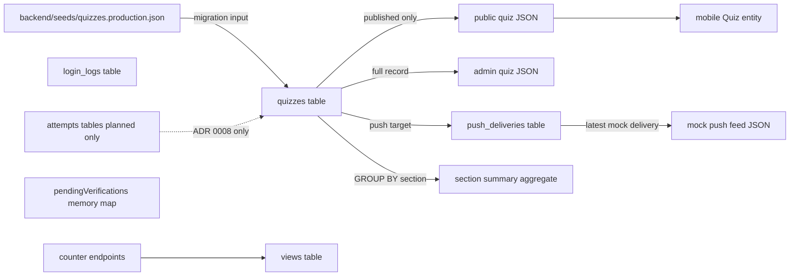
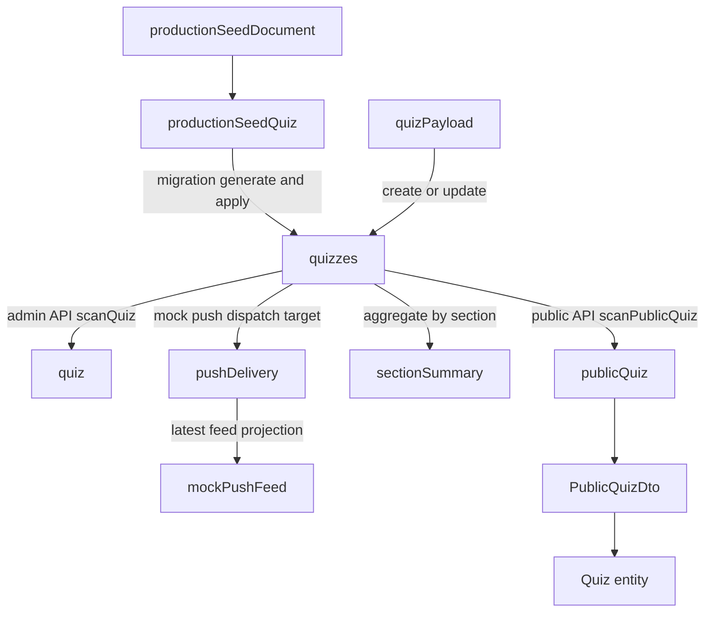

# データモデル

現在の永続データ、seed JSON、API へ露出する投影モデルの関係を整理する。
対象は 2026-05-25 時点で **実装済みのモデル** を中心とし、ADR にだけ存在する将来モデルは最後に分離して記載する。

## 全体像

## 永続テーブル

| テーブル | 主キー | 用途 | 備考 |
| --- | --- | --- | --- |
| `quizzes` | `id` | クイズ本体 | 公開状態と push 対象フラグを保持する中心テーブル |
| `views` | `id` | PV カウンター | 実質 1 行だけを使う singleton テーブル |
| `login_logs` | `id` | 管理ログイン監査 | 成功・失敗の監査ログを append-only で保持する |
| `push_deliveries` | `id` | Push 通知配信履歴 | Phase A では mock 配信のみ記録する |

現時点で `push_deliveries.quiz_id` は `quizzes.id` への外部キーを持つ。`views` と `login_logs` は補助データとして独立している。

## `quizzes` テーブル

`quizzes` は本番環境の Single Source of Truth であり、管理画面の CRUD と公開 API の配信元を兼ねる。

| カラム | 型 | 必須 | 役割 |
| --- | --- | --- | --- |
| `id` | `BIGSERIAL` | yes | クイズ ID |
| `section` | `TEXT` | yes | セクション名 |
| `title` | `TEXT` | yes | 一覧や管理画面向けの短い題名 |
| `question` | `TEXT` | yes | 問題文 |
| `code` | `TEXT` | no | 任意のコード断片 |
| `options` | `JSONB` | yes | 選択肢文字列の配列 |
| `correct_answer_index` | `INT` | yes | `options` 内の正解位置 |
| `explanation` | `TEXT` | yes | 解説 |
| `source` | `TEXT` | yes | 出典 |
| `status` | `VARCHAR(20)` | yes | `published` または `unpublished` |
| `push_enabled` | `BOOLEAN` | yes | push 通知送信候補かどうか |
| `created_at` | `TIMESTAMPTZ` | yes | 作成日時 |
| `updated_at` | `TIMESTAMPTZ` | yes | 更新日時 |

### 実装上の注意

- `options` は正規化された子テーブルではなく `JSONB` 配列で保持する
- `correct_answer_index` と `options` の整合性は DB 制約ではなくアプリケーション側の検証で守っている
- `status` は DB enum ではなく文字列カラムなので、値域制約もアプリケーション側に寄っている
- `push_enabled` の既定値は `false`
- seed 同期では `status` と `push_enabled` を seed JSON から読まず、既存値保持または既定値で扱う

## `views` テーブル

`views` は `GET /counter` と `POST /counter` 専用の小さなテーブルで、`id = 1` の 1 行だけを前提にしている。

| カラム | 型 | 必須 | 役割 |
| --- | --- | --- | --- |
| `id` | `INT` | yes | カウンター識別子。現在は常に `1` |
| `count` | `INT` | yes | 現在の PV 値 |

### 実装上の注意

- migration で初期行 `id = 1, count = 0` を insert する
- 一般的な multi-counter 設計ではなく、現状は singleton カウンターとして扱っている

## `login_logs` テーブル

`login_logs` は管理者ログイン試行の監査ログであり、アカウントテーブルへの参照は持たない。

| カラム | 型 | 必須 | 役割 |
| --- | --- | --- | --- |
| `id` | `BIGSERIAL` | yes | ログ ID |
| `username` | `TEXT` | yes | 入力されたユーザー名 |
| `success` | `BOOLEAN` | yes | 成功か失敗か |
| `ip_address` | `TEXT` | yes | `X-Forwarded-For` 優先の接続元 |
| `user_agent` | `TEXT` | yes | クライアント UA |
| `created_at` | `TIMESTAMPTZ` | yes | 記録時刻 |

### 実装上の注意

- 成功時と失敗時にだけ書き込まれる
- verification challenge の発行時点では書き込まれない
- `created_at DESC` の index を持つ

## `push_deliveries` テーブル

`push_deliveries` は Push 通知配信履歴を記録するテーブルである。
Phase A では Firebase / FCM へは送らず、mock 配信として「送信したつもり」の履歴だけを保持する。

| カラム | 型 | 必須 | 役割 |
| --- | --- | --- | --- |
| `id` | `BIGSERIAL` | yes | 配信履歴 ID |
| `quiz_id` | `BIGINT` | yes | 配信対象クイズ。`quizzes.id` への外部キー |
| `channel` | `VARCHAR(20)` | yes | 配信チャネル。Phase A は `mock`、将来 `fcm` を想定 |
| `target_count` | `INT` | yes | 配信対象数。mock では `0` |
| `status` | `VARCHAR(20)` | yes | 配信状態。Phase A は `mock_sent`、将来 `failed` などを想定 |
| `error_detail` | `TEXT` | no | 失敗時の詳細。mock 成功時は未使用 |
| `sent_at` | `TIMESTAMPTZ` | yes | 配信記録時刻 |

### 実装上の注意

- `sent_at DESC` と `quiz_id` の index を持つ
- `GET /v1/push/feed` は、このテーブルから最新の `channel = 'mock'` かつ `status = 'mock_sent'` の 1 件を返す予定
- 本番 FCM 配信に必要な `device_tokens` はまだ未実装であり、このテーブルには端末トークンを保存しない

## Seed JSON と投影モデル

永続テーブルだけ見ると API とのズレが見えにくいため、主要な JSON 形状も整理する。

| モデル | 由来 | `quizzes` との差分 |
| --- | --- | --- |
| `productionSeedQuiz` | `backend/seeds/quizzes.production.json` | `status`, `pushEnabled`, `createdAt`, `updatedAt` を持たない |
| `quizPayload` | 管理 API の create/update 入力 | `id`, `createdAt`, `updatedAt` を持たない |
| `quiz` | 管理 API の完全レコード | `quizzes` のほぼ 1:1 表現 |
| `publicQuiz` | 公開 API の出力 | `status`, `pushEnabled`, `createdAt`, `updatedAt` を意図的に隠す |
| `sectionSummary` | 公開 API の集計出力 | `quizzes` から `section` 単位で件数集計した派生モデル |
| `mockPushFeed` | 公開 API の出力予定 | `push_deliveries` と `quizzes` を JOIN した最新 mock 配信 |
| `mobile Quiz` | Flutter domain entity | `publicQuiz` を domain に写した形で、管理用メタデータを持たない |

## 変換フロー

### モデル差分の要点

- seed JSON は「本番シードテンプレート」であり、正本ではない
- 管理 API は公開状態や push 設定を含む完全モデルを返す
- 公開 API は利用者に不要な運用メタデータを落として返す
- Push 通知 mock feed は配信履歴とクイズ題名・本文を合成した投影モデルとして扱う
- Flutter は公開 API DTO をさらに domain entity へ写像する

## 非永続・一時モデル

永続化されないが、データモデルとして把握しておくべきものもある。

| モデル | 保管場所 | 役割 |
| --- | --- | --- |
| `verificationChallenge` | Go プロセス内 `pendingVerifications` map | 管理ログインの challenge ID と確認コードを 5 分保持する |
| Web 履歴 | `localStorage` | ユーザー回答履歴の一次ソース |
| Mobile 履歴 | 将来 `shared_preferences` 想定 | モバイル側のローカル履歴 |

### 実装上の注意

- `verificationChallenge` は DB に保存されないため、サーバー再起動で消える
- 回答履歴はまだサーバー永続化されていない

## 将来モデル

ADR 0008 と OpenAPI ドラフトには、匿名集計用の `attempts` / `attempt_answers` が出てくる。
ただし **現時点では migration に存在せず、実装も未着手** である。

| モデル | 状態 | 出典 |
| --- | --- | --- |
| `attempts` | Proposed only | `docs/adr/0008-user-attempt-history.md` |
| `attempt_answers` | Proposed only | `docs/adr/0008-user-attempt-history.md` |
| `POST /v1/attempts` | OpenAPI draft only | `docs/api/public-quiz-api.yaml` |
| `device_tokens` | Proposed only | `docs/adr/0007-push-notification-delivery.md` |
| FCM / cron delivery | Proposed only | `docs/adr/0007-push-notification-delivery.md` |

このため、2026-05-25 時点の実データモデルとしては `quizzes`, `views`, `login_logs`, `push_deliveries` の 4 テーブルを正とする。

## 更新ガイド

このドキュメントは、以下の変更が入ったときに更新する。

| 変更内容 | 更新箇所 |
| --- | --- |
| migration で新テーブル追加 | 永続テーブル、全体像 |
| `quizzes` カラム追加・削除 | `quizzes` テーブル、投影モデル |
| 公開 API のレスポンス変更 | Seed JSON と投影モデル、変換フロー |
| Push 通知の配信履歴や feed 変更 | `push_deliveries` テーブル、変換フロー、将来モデル |
| 回答履歴 API を実装 | 将来モデルを実装済みモデルへ昇格 |
