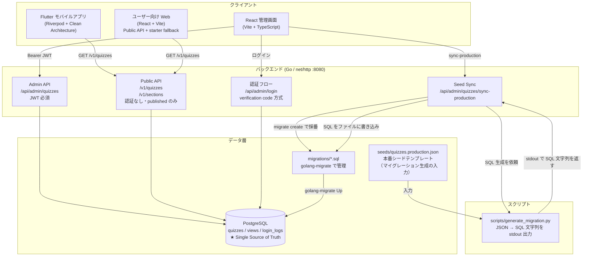
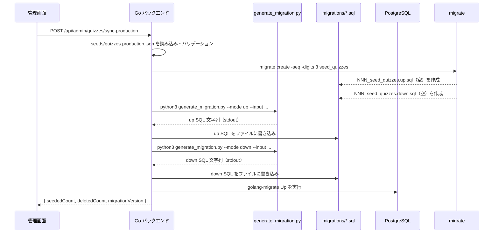

# システム構成概要

クイズアプリの全体アーキテクチャ。各レイヤーの役割と通信経路を示す。

## コンポーネント図



## 各コンポーネントの役割

### Flutter モバイル (`packages/mobile/`)

Clean Architecture 3層構成。

| 層 | ディレクトリ | 役割 |
|----|------------|------|
| Presentation | `layers/presentation/` | 画面・Riverpod Notifier |
| Domain | `layers/domain/` | Entity・UseCase・Repository Interface |
| Data | `layers/data/` | API クライアント・ローカルデータソース |

データソースは `quiz_remote_repository_impl.dart`（Public API）と `quiz_repository_impl.dart`（ローカル JSON）が共存しており、`remote_providers.dart` で切り替える。

### ユーザー向け Web (`packages/web/`)

React 19 + Vite + TypeScript の SPA。クイズの解答 UI と正答率・履歴のローカル保存が責務。

`VITE_API_BASE_URL` があるときは `GET /v1/quizzes` を使い、未設定・失敗時は `src/data/quizzes.ts` の starter pack にフォールバックする（`packages/web/README.md` 参照）。

### React 管理画面 (`packages/admin-web/`)

Vite + TypeScript の SPA。`/api/admin/` エンドポイントのみ使用。JWT は localStorage 管理。

### Go バックエンド (`packages/backend/`)

`package main` を責務別ファイルに分割（`main.go` は起動とルーティング）。ルート定義は `routes()` を参照。

公開ポート（本番は HTTPS 443）:

| 環境 | クライアントが叩く先 | コンテナ内 |
|---|---|---|
| 開発（docker-compose） | `http://localhost:8082` | `8080` |
| 本番 | `https://socrates-quiz.jp`（**443**） | `8080` |

本番は ALB / CloudFront 等で TLS 終端し、公開面は 443 のみとする。ホスト名は `socrates-quiz.jp`。管理画面は ADR 0005 どおり別ホストで配信する（ホスト名は未定）。

**Public API（認証なし）**

| メソッド | パス | 説明 |
|---------|------|------|
| GET | `/v1/quizzes` | published クイズ一覧（section・limit・offset 絞り込み可） |
| GET | `/v1/quizzes/{id}` | 個別クイズ取得 |
| GET | `/v1/sections` | セクション一覧（件数付き） |

**Admin API（JWT Bearer 必須）**

| メソッド | パス | 説明 |
|---------|------|------|
| GET | `/api/admin/quizzes` | 一覧（フィルター・ページネーション） |
| POST | `/api/admin/quizzes` | 新規作成 |
| PUT | `/api/admin/quizzes/{id}` | 更新 |
| DELETE | `/api/admin/quizzes/{id}` | 削除 |
| PATCH | `/api/admin/quizzes/{id}/status` | 公開状態トグル |
| PATCH | `/api/admin/quizzes/{id}/push` | Push通知トグル |
| POST | `/api/admin/quizzes/sync-production` | Seed 同期（後述） |

### Seed 同期フロー

管理画面から `sync-production` を叩くと以下が連鎖する。



### データベース

| テーブル | 用途 |
|---------|------|
| `quizzes` | クイズ本体（status で公開管理） |
| `views` | PV カウンター |
| `login_logs` | 管理者ログイン履歴 |

---

## 更新ガイド

このドキュメントは**手動更新**。以下のタイミングで該当箇所を修正する。

| 変更内容 | 更新箇所 |
|---------|---------|
| API エンドポイント追加・削除 | Admin/Public API テーブル |
| 公開ポート・本番 URL の変更 | 公開ポート表、`docs/api/public-quiz-api.yaml` の `servers` |
| 新しい Flutter レイヤー・DataSource | コンポーネント図・Flutter 説明 |
| DB テーブル追加 | データベーステーブル一覧 |
| Seed 同期ロジック変更 | Seed 同期フローのシーケンス図 |
| ハンドラ・SQL・画面内状態などの内部設計 | `docs/detailed-design/`（`meta.json` も更新） |

更新プロンプト例（Claude Code 用）:

```
docs/architecture/overview.md の Seed 同期フローを現在のコードに合わせて更新して
```
