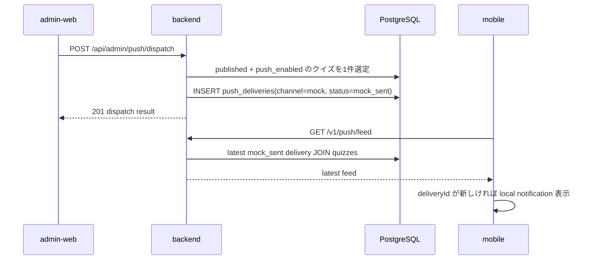

# Push 通知モック

Firebase / FCM を使わずに、Push 通知の配信フローをローカルで確認するための Phase A 実装メモ。

## 目的

管理画面から手動で mock Push を送信し、backend に配信履歴を保存し、mobile が公開 feed を polling してローカル通知を表示する。

## Backend

### DB

`backend/migrations/015_create_push_deliveries.*.sql` で `push_deliveries` を追加する。

| カラム | 用途 |
| --- | --- |
| `quiz_id` | 配信対象クイズ |
| `channel` | Phase A は `mock` |
| `target_count` | mock では `0` |
| `status` | Phase A は `mock_sent` |
| `sent_at` | 配信記録時刻 |

### Admin API

`POST /api/admin/push/dispatch`

- JWT 必須
- `status = published` かつ `push_enabled = true` のクイズから1件選ぶ
- 直近7日以内に配信済みのクイズは除外
- 候補なしは `422` + `code: no_push_candidates`

### Public API

`GET /v1/push/feed`

- 認証なし
- 最新の `channel = mock` かつ `status = mock_sent` の配信を1件返す
- 配信なしは `404` + `code: push_feed_not_found`

## admin-web

クイズ一覧に以下を追加する。

- `mock Push 送信` ボタン
- mock Push 配信履歴テーブル
- `PushBadge` の説明文（Push ON の公開クイズだけが候補）

## mobile

`flutter_local_notifications` と `shared_preferences` を利用する。

- `QuizApiClient.fetchPushFeed()` が `GET /v1/push/feed` を呼ぶ
- `PushFeedPoller` が最後に表示した `deliveryId` を保存する
- 新しい `deliveryId` の場合だけ `LocalNotificationService.showPushFeed()` を呼ぶ
- 通知 payload には `quizId` を入れ、タップ時に `QuizDetailsPage` へ遷移する

## 手動確認

1. backend を起動する
2. admin-web でクイズを `published` / Push `ON` にする
3. admin-web の `mock Push 送信` を押す
4. admin-web の配信履歴に1件追加されたことを確認する
5. mobile を起動し、通知アイコンを押して feed を確認する
6. ローカル通知が出ることを確認する
7. 通知をタップし、対象クイズ詳細へ遷移することを確認する

## Phase B への差し替え

本番 FCM 化するときは、以下を別タスクで追加する。

- `device_tokens` テーブル
- mobile の FCM token 登録
- FCM 送信クライアント
- cron による毎日 JST 09:00 配信
- `channel = fcm` の配信履歴
