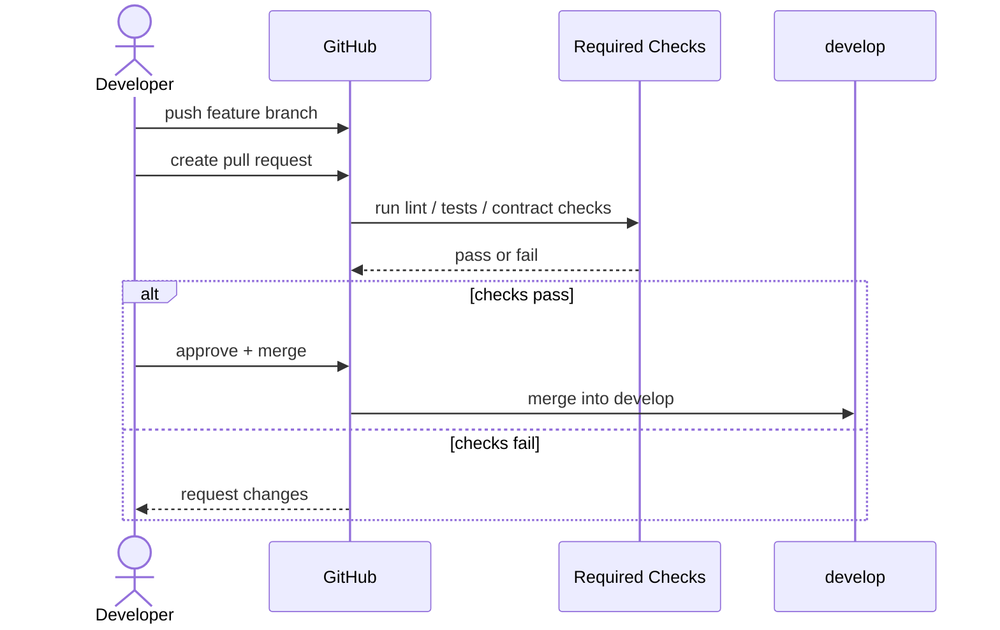

# Mermaid

Mermaid は GitHub / Markdown と相性がよく、最小構成のシーケンス図に向いています。

## 目的

- PR / branch workflow を可視化する
- 認証・reset / verify email の流れを説明する
- docs に埋め込みやすい

## 例

```mermaid
sequenceDiagram
    actor Dev as Developer
    participant GH as GitHub
    participant CI as Required Checks
    participant BR as develop

    Dev->>GH: push feature branch
    Dev->>GH: create pull request
    GH->>CI: run lint / tests / contract checks
    CI-->>GH: pass or fail
    alt checks pass
        Dev->>GH: approve + merge
        GH->>BR: merge into develop
    else checks fail
        GH-->>Dev: request changes
    end
```
