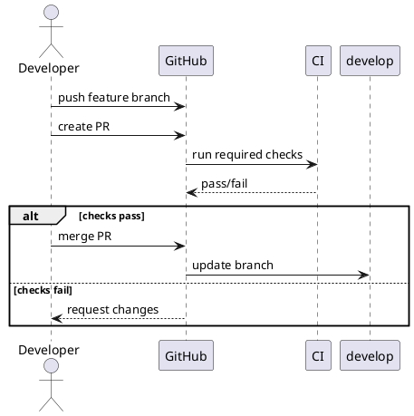

# PlantUML

PlantUML はテキストベースで、設計書や詳細図に向いています。

## 目的

- シーケンス図をコードとして管理する
- 生成物を CI で追跡しやすくする
- 細かい図表現を強くしたいときに利用する

## 例

```plantuml
@startuml
actor Developer
participant GitHub
participant CI
participant develop

Developer -> GitHub: push feature branch
Developer -> GitHub: create PR
GitHub -> CI: run required checks
CI --> GitHub: pass/fail
alt checks pass
  Developer -> GitHub: merge PR
  GitHub -> develop: update branch
else checks fail
  GitHub --> Developer: request changes
end
@enduml
```
